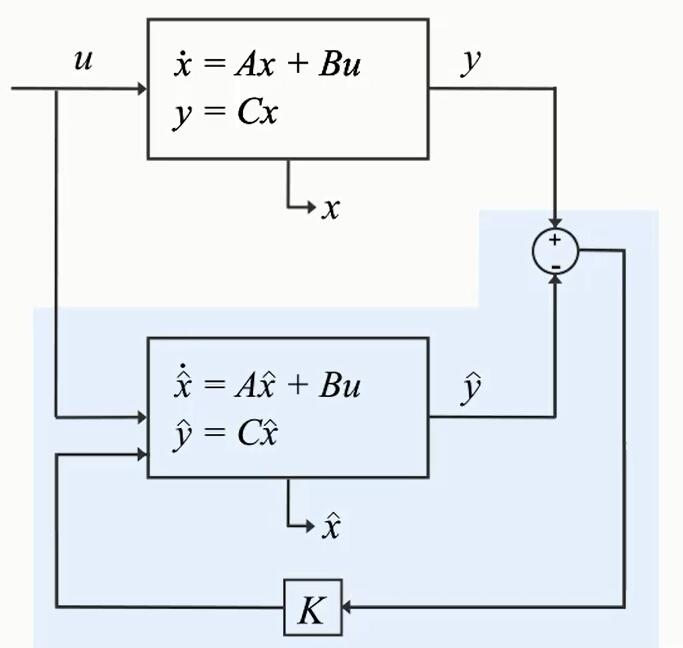

视频来源:(Matlab Tech talks)
```C
/*
链接：https://pan.baidu.com/s/1YtFgZUrheSF8m4UC2xYn1Q 
提取码：aq0f 
复制这段内容后打开百度网盘手机App，操作更方便哦
*/
```


# video01

+ what 's “Kalman Filter”?
  + A Kalman Filter is an optimal estimation algorithm.
  + 是一种优化估算算法.
  + 是一种设计最优状态观测器的方法.
+ 用途:
  + 例子1：估算系统状态,当它无法直接被测量时,可以间接测量来估计.
    + 火箭发动机燃烧室的内部温度非常高，没有传感器能够直接测量，但是燃烧温度过高，会烧毁火箭的关键部件，需要估计无法直接测量的物理量, 需要根据其他外部部位的温度来估算火箭发动机内部燃烧的温度.
  + 例子2：利用组合各种可能受噪声影响的数据源，使用卡尔曼滤波器来估算系统的状态.
    + 汽车导航系统需要知道当前位置的信息来源有：__惯性测量单元__(IMU,板上传感器,Onboard Sensors),包含加速度传感器和陀螺仪,__里程表__可以反映汽车行驶的相对距离;__GPS__接收卫星传来的信息.
    + 当车辆行驶到隧道内部时，GPS信号微弱(weak)或受到干扰，我们很难用GPS来估计位置.
    + 此时，我们就需要用IMU提供的信息，为我们估算位置信息.
      + 加速度本身不告诉我们骑汽车的位置，我们可以对加速度进行二次积分得到估算里程，但误差会随着时间不短累积；
      + 里程表读数也可能受到轮胎压力和道路状况的影响；
      + IMU可以测量汽车的相对位置，可以快速更新，但是很容产生漂移；
      + GPS提供绝对位置，但是信号更新很慢，而且很可能有噪音.
      + 我们需要结合三个测量值，得到汽车最合适的估算位置。
  + 常见应用场合:
    + 制导与导航控制系统(guidance and navigation systems)
    + 计算机视觉系统(computer vision systems) 
    + 信号处理(signal processing)


***

# video02

## 状态观测器(State Observers)

+ 给系统一个输入，通过观察系统的输出，来估计无法直接查看或测量的内容。

+ 状态观测器得到的估计状态用小帽子来表示：$\hat{X}$,(Estimated state)

+ 以火箭为例:内部温度$T_{in}$无法直接测量，外部温度$T_{ext}$可以测量得到，宇航系统可以通过测量$T_{ext}$和燃油流量来估算$T_{in}$.

+ 通过燃油流量的数学模型(Mathematical model)，我们可以得到估计的输出$\hat{T}_{ext}$和$\hat{T}_{in}$,完美的数学模型达到非常困难，还要初始条件一致，往往股计算的外部温度并不能吻合测量的温度.

+ 如果估计的外部温度能与测量的外部温度吻合($\hat{T}_{ext} \to T_{ext}$)，那么表示模型收敛到了真实系统；那么估算的内部温度也能收敛到真实的内部温度($\hat{T}_{in} \to T_{in}$)。

+ 我们尝试消除估算和测量外部温度之间的误差$e=error=T_{ext}-\hat{T}{ext}$，来反馈控制数学模型中对外部温度和内部温度的估算.

+ 通过观测器机器控制器$K$形成的闭环，问题在于如何选择控制增益$K$,使得测量和估算外部温度之间的误差最小化.

+ 状态观测器的数学方式表示：

  

  + 若输入为$u$,输出为$y$,我们需要估计$\hat{x}$以让它逼近$x$.
  
  + 对于观测误差:
    $$
    e_{obs}=x-\hat{x}
    $$
    
  + 我们可以得到系统的方程
    $$
    \begin{eqnarray}
    \dot{x}&=&Ax+Bu\\
    y&=&Cx
    \end{eqnarray}
    $$
    
  + 和观测器的方程
    $$
    \begin{eqnarray}
    \dot{\hat{x}}&=&A\hat{x}+Bu + K(y-\hat{y})\\
    \hat{y}&=&C\hat{x}
    \end{eqnarray}
    $$
    
  + 根据系统的方程和观测器的方程做差可以得到
    $$
    \begin{eqnarray}
    \dot{x}-\dot{\hat{x}}&=&Ax-A\hat{x}+Bu-Bu-K(y-\hat{y})\\
    &=&Ax-A\hat{x}-K(y-\hat{y})\\
    \dot{e}_{obs}&=&Ae_{obs}+KC(x-\hat{x})\\
    &=&(A-KC)e_{obs}
    \end{eqnarray}
    $$
  
  + 方程$(9)$的解是指数函数
    $$
    e_{obs}(t)=e^{(A-KC)t}e_{obs}(t)
    $$
    当$(A-KC)<0$,则$t\to +\infty$时，$e_{obs}\to 0$,则$\hat{x}\to x$.
  
    即便没有$KC$项，当$A<0$，依然有此结论.
  + 给观测器建立反馈回路的重要性在于,我们可以控制误差函数的衰减率(通过选择相应的控制器增益K),而不仅仅是通过矩阵$A$,因为我们无法找到真的矩阵$A$.
  


# Video03

+ 例子:自动驾驶大赛.

  + 均值靠近终点，方差尽量小，不能完全按照GPS的信息进行驾驶.

  + 需要使用卡尔曼滤波器来估算汽车的位置.

  + 输入时汽车的油门$u_k$,输出是我们感兴趣的汽车的位置$y_k$,$v_k$表示GPS的噪音，这是一个随机变量,$w_k$表示过程噪声，可以代表风的影响或汽车速度的变化.
    $$
    \begin{eqnarray}
    x_k&=&Ax_{k-1}+Bu_k+w_k\\
    y_k&=&Cx_k + v_k\\
    x_k&=&[position]\\
    C&=&1
\end{eqnarray}
    $$
    
  + 假设$V$服从具有零均值和协方差矩阵$R=\sigma^2_v$的高斯分布,同样过程噪声也服从具有零均值和协方差矩阵$R=\sigma_w^2$的高斯分布.
    $$
    \begin{eqnarray}
    v&\sim{}&N{(0,R)}\\
    w&\sim{}&N{(0,Q)}
  \end{eqnarray}
    $$
  
  + 实际上我们的测量也不能完全反映汽车的真实位置，我们可以运用数学模型来估算位置
    $$
    \begin{eqnarray}
    \hat{x}_{k}&=&A\hat{x}_{k-1}+Bu_k\\
    \hat{y}_k&=&C\hat{x}_k
    \end{eqnarray}
  $$
    
  + (借助概率密度函数),在初始时间$k-1$,实际汽车位置可以是在估计值$\hat{x}_{k-1}$附近的任何位置,这表明汽车最有可能在这个缝补的平均值附近。
  
  + 在下一个时间$k$,估计的不确定性增加,用较大的方差表示。
  
  + 在$t=k-1 \to k$,汽车可能已经越过坑洼，因此他可能已经行进了与模型预测的距离不同的距离。
  
  + 汽车位置还有另外一个来源来自测量$y_k$，方差表示测量中的不确定性，真实值的位置可以是平均值的任何位置。
  
  + 那么对汽车位置的最佳估计是什么？事实证明，是将这两部分信息结合起来。通过将这两个概率函数相乘来完成的。这样该估计值的方差小于先前估计值，并且该概率密度函数的平均值提供了汽车位置的最佳估计。
  


# video04

本视频讨论实现卡尔曼滤波算法所需的方程组。
+ 如何用卡尔曼滤波器获得胜利?
  + 他能计算最优无偏差汽车位置预估值，而且方差最小。
  + 计算最优值首先将预测和测量概率函数相乘，方差范围减小，然后计算得到概率密度函数的均值。
  + 从计算上说，这两个概率密度函数的乘法，与离散卡尔曼滤波器方程有关。
  $$
  \hat{x}_{k} = A\hat{x}_{k-1} + Bu_k + K_k(y_k - C(A\hat{x}_{k-1+Bu_k}))
  $$
  + 状态观测器方程
  $$
  \hat{x}_{k+1} = A\hat{x}_k + Bu_k + K(y_k - C\hat{x}_k)
  $$
  + 实际上,卡尔曼滤波器就是一种状态观测器，但它是为随机系统设计的。
  + 其中第一部分预估值$\hat{x}_{k}^{-}=A\hat{x}_{k-1}+Bu_k$预测当前状态，使用前一个时间的估算状态以及当前的输入.他是在使用当前测量值之前计算的。
  + 则卡尔曼滤波器方程可以改写为:
  $$
  \hat{x}_k = \hat{x}_{k}^{-} + K_k(y_k - C\hat{x}_{k}^{-})
  $$
  + 第二部分$K_k(y_k-C\hat{x}_{k}^{-})$使用测量值带入方程来更新预估值。
  + 结果$\hat{x}_k$被称为后验估值。

+ 总结一下方程
  预测方程
  $$
  \begin{eqnarray}
  \hat{x}_{k}^{-} &=& A\hat{x}_{k-1}+Bu_k\\
  P_{k}^{-}&=&AP_{k-1}A^{T} + Q
  \end{eqnarray}
  $$
  更新方程
  $$
  \begin{eqnarray}
  K_k&=&\frac{P_{k}^{-}C^T}{CP_{k}^{-}C^T+R}\\
  \hat{x}_k&=&\hat{x}_{k}^{-} + K_k(y_k - C\hat{x}_{k}^{-})\\
  P_k&=&(1-K_kC)P_{k}^{-}
  \end{eqnarray}
  $$

+ 详解方程:
  + 卡尔曼滤波分为两步:预测和更新。
  + __预测步骤__:系统模型用于计算状态预估值$\hat{x}_{k}^{-}$和误差协方差P
  $$
  \begin{eqnarray}
  \hat{x}_{k}^{-} &=& A\hat{x}_{k-1}+Bu_k\\
  P_{k}^{-}&=&AP_{k-1}A^{T} + Q
  \end{eqnarray}
  $$
  其中$P$是状态预估值的方差，也就是$\hat{x}_{k}^{-}$的方差，作为在预测状态中的不确定性的度量，这种不确定性来自__过程噪声__和预估值$\hat{x}_{k-1}$的不确定性的影响.
  + 在计算的初始,$\hat{x}_{k-1}$和$P_{k-1}$来自于初始估计值。
  + __更新步骤__:使用预测步骤中计算得到的预估值,更新后的状态值及其误差协方差。
  + $K_k=\frac{P_{k}^{-}C^T}{CP_{k}^{-}C^T+R}$ 调整卡尔曼增益，使得更新后的状态值误差协方差最小.
  通过调整增益确定测量值和预估值对$\hat{x}_k$的影响程度：如果测量噪音较小，则测量值更可靠，则应对$\hat{x}_{k}$的计算贡献更大；在相反的情况下，预估值的误差很小，则预估值更可信，所以$\hat{x}_{k}$的计算更多的取决于预估值。
  + 在两种极端情况下展示这个数学表达式
    + 第一种情况，测量协方差$R\to 0$,则此时的卡尔曼增益
    $$
    \begin{eqnarray}
    \lim_{R\to 0}K_k&=&\lim_{R\to 0}\frac{P_{k}^{-}C^T}{CP_{k}^{-}C^T+R}\\
    &=&C^{-1}=-1
    \end{eqnarray}
    $$
    可以得到
    $$
    \begin{eqnarray}
    \hat{x}_k&=&\hat{x}_{k}^{-} + K_k(y_k - C\hat{x}_{k}^{-})  \\
    &=&y_k
    \end{eqnarray}
    $$
    从概率学上，$R\to 0$时，概率密度函数退化成单位冲激函数$\delta(t)$

    + 第二种情况，预估误差方差接近于零$P_{k}^{-}\to 0$，则笛卡尔增益直接为0.则
    $$
    \hat{x}_{k} = \hat{x}_{k}^{-}
    $$
    从数学上也可以类似上面理解，概率密度函数退化成冲激函数了。

  + 计算完更新方程后，在下一个时间点，修正值用于预测新的预估值，继而重复，要计算现在的状态，算法不需要所有过去的信息，只需要预估状态值和前一时间的误差协方差矩阵以及当前的测量值
  + 卡尔曼滤波器也被称为__传感器融合算法__.


# video05

非线性系统状态估算
+ 生活不是线性的，我们经常需要处理非线性系统.
+ 系统建模的时候就是非线性的:
$$
\begin{eqnarray}
x_k&=&f(x_{k-1},u_k)+w_k\\
y_k&=&g(x_k) + v_k
\end{eqnarray}
$$
在一般系统中，无论状态转换函数还是观测函数，两者都可能是非线性的。
+ 此时，我们需要使用__非线性状态估算__来替代卡尔曼滤波器。
+ 卡尔曼滤波器仅针对线性系统，假设噪声分布为高斯分布，在经理线性变换后，分布依然保持高斯特性。
+ 若$f(x)$非线性，则状态分布可能不是高斯分布的，则卡尔曼滤波器可能会不收敛。
+ 在这种情况下，可以使用__扩展卡尔曼滤波器__(EKF),他把非线性在当前估算状态的平均值附近进行线性化。
  + 在每个时间点都执行线性化，然后把得到的雅可比矩阵用于预测和更新卡尔曼滤波器算法的状态。
  + 当系统是非线性的，并且可以通过线性化很好的近似时，那么扩展卡尔曼滤波器是状态估算的一个很好的选择。
  + 缺点：
    + 导数复杂，可能难以解析地计算雅可比矩阵。
    + 以数值方式计算可能需要很高的计算成本。
    + 扩展卡尔曼滤波器不适用于具有不连续模型的系统，因为系统不可微分时雅可比矩阵不存在。
    + 高度非线性系统的线性化效果并不好。
      + 线性化无效，非线性函数并不能通过线性函数很好的近似表达出来；
      + 描述不了系统动力学。

+ UKF(Unscented Kalman Filters) 无味卡尔曼滤波器
  + 为了克服EKF的缺点。
  + 创立者注意到了同事办公桌上的除臭剂才想出了这个名字。
  + UKF并不像扩展卡尔曼滤波器那样近似非线性函数，无味卡尔曼滤波器近似概率分布。
    + 无迹卡尔曼滤波选择一组很小的采样点，让他们的均值和协方差与该分布相同。这些点被称为西格玛点，并且围绕均值对称分布。
    + 每个西格玛点通过非线性系统模型计算，并计算非线性变换后的输出点的均值和协方差，计算经验高斯分布，用来计算新的状态值。
    + 在线性卡尔曼滤波器算法中，在预测步骤使用状态转义函数计算误差协方差$P$,然后使用测量量进行更新。
    + 而在无迹的卡尔曼滤波器中，我们不能以相同的方式计算他，因为我们以经验方式得到他。

+ 基于相似原理的另外一种非线性状态估计器是粒子滤波器(PF)
  + 它使用的样本点称为粒子(Particles)
  + 与无迹卡尔曼滤波器的显著差异在于,粒子滤波器近似任意分布，所以不仅限于高斯假设。
  + 为表示未明确知道的任意分布，粒子滤波器所需要的粒子数远远大于无迹卡尔曼滤波器所需的粒子数。

+ 各种相关滤波器比较

  |       State Estimator        |          Model           | Assumed distribution | Computational cost |
  | :--------------------------: | :----------------------: | :------------------: | :----------------: |
  |      Kalman filter(KF)       |          Linear          |       Gaussian       |      __Low__       |
  | Extended Kalman filter(EKF)  | Locally Linear(局部线性) |       Gaussian       |     Low~Medium     |
  | Unscented Kalman filter(UKF) |        Nonlinear         |       Gaussian       |       Medium       |
  |     Particle filter(PF)      |        Nonlinear         |     Non-Gaussian     |      __High__      |


# Video06

在Simulink中使用Kalman filter仿真


# Video07

在 Simulink 中使用扩展卡尔曼滤波器


