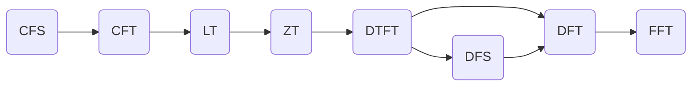

# 
数字信号处理中的各种变换-理论篇

***

| 文件版本 |      修改内容      |       作者/时间       |   备注   |
| :------: | :----------------: | :-------------------: | :------: |
|   V1.1   |  完成主干理论推导  | AlimyBreak/2019.08.12 |    -     |
|   V1.0   | 挖坑开始编写该文档 | AlimyBreak/2019.06.20 | 底稿已失 |

***

## 一、概述

+ 傅立叶变换 傅立叶级数种类繁多，这里统一梳理大学基础课程(__信号与系统__、__数字信号处理__)中涉及到的一些级数和变换，主要完成对主干理论的推导，说明各种变换之间的联系和关系。
  + CFS：连续时间__周期__信号的傅立叶级数分解
  + CFT：连续时间信号的傅立叶变换
  + LT:拉普拉斯变换
    + 一般连续信号在衰减因子影响下的CFT
  + ZT:Z变换
    + 等间隔采样信号的拉普拉斯变换
  + DTFT:离散时间傅立叶变换分解
  + DFS：离散时间__周期__信号的傅立叶级数分解
+ DFT：有限长序列的傅立叶变换
  + FFT：快速的DFT计算方法，本质上是DFT的计算优化
+ 本文档默认读者(如果有读者的话)已经具备大一高等数学中傅立叶级数、欧拉公式和定积分等基础知识，涉及到复变函数的内容本文档已主动屏蔽，需要了解这部分的内容可自行学习《复变函数》、《数学物理方法》等课程。
+ 相关变换之间的关系流程图如下如所示.

***

​	

## 二、各种变换

***

### 2.1 CFS(连续时间傅立叶级数)

+ 适用信号类型:连续时间信号且满足周期性(数学上还应该满足__狄利克雷三条件__)

+ 正逆变换公-三角形式，其中$T$为连续时间信号的周期：
  $$
  \tag{2-1}
  f(t)=a_{0}+\sum_{n=1}^{+\infty}a_{n}cos(n\omega_{1}t)+b_{n}sin(n\omega_{1}t)=a_{0}+\sum_{n=1}^{+\infty}c_{n}sin(n\omega_{1} t+\phi_{n})
  $$
  
  $$
  \begin{cases}
  \tag{2-2}
  a_{0} = \frac{1}{T}\int_{t_0}^{t_0+T}f(t)dt\\
  a_{n} = \frac{2}{T}\int_{t_0}^{t_0+T}f(t)cos(n\omega_{1} t)dt \\
  b_{n} = \frac{2}{T}\int_{t_0}^{t_0+T}f(t)sin(n\omega_{1} t)dt \\
  \end{cases}
  $$
  其中
  $$
  \begin{cases}
  \tag{2-3} 
  c_{n}=\sqrt{a_{n}^2+b_{n}^2}\\
  \phi_n=arctan(\frac{a_{n}}{b_{n}})\\
  \omega_{1} = \frac{2\pi}{T}
  \end{cases}
  $$

+ 根据欧拉公式
  $$
  e^{j\theta}=cos(\theta)+jsin(\theta)
  $$
  可以得到：
  $$
  \begin{cases}
  \tag{2-4}
  cos(n\omega_{1} t) = \frac{e^{jn\omega_{1} t}+e^{-jn\omega_{1} t}}{2} \\
  sin(n\omega_{1} t) = j\frac{e^{-jn\omega_{1} t}-e^{jn\omega_{1} t}}{2} \\
  \end{cases}
  $$
  根据$\tag{2-4}$对$\tag{2-1}$进行替换可以得到：
  $$
  \begin{eqnarray}
  \tag{2-5}
  f(t)&=&a_{0}+\sum_{n=1}^{+\infty}a_{n}cos(n\omega_{1} t)+b_{n}sin(n\omega_{1} t) \\
  &=&a_{0}+\sum_{n=1}^{+\infty}a_{n}\frac{e^{jn\omega_{1} t}+e^{-jn\omega_{1} t}}{2}+b_{n}j\frac{e^{-jn\omega_{1} t}-e^{jn\omega_{1} t}}{2}\\
  &=&a_{0}+\sum_{n=1}^{+\infty}\frac{1}{2}(a_{n}-jb_{n})e^{jn\omega_{1} t}+\frac{1}{2}(a_{n}+jb_{n})e^{-jn\omega_{1} t}
  \end{eqnarray}\\
  $$
  记：
  $$
  \begin{eqnarray}
  \tag{2-6}
  F(n)&=&\frac{1}{2}(a_{n}-jb_{n}) \\
  &=&\frac{1}{T}\int_{t_0}^{t_0+T}f(t)cos(n\omega_{1} t)dt-j\frac{1}{T}\int_{t_0}^{t_0+T}f(t)sin(n\omega_{1} t)dt)\\
  &=&\frac{1}{T}\int_{t_0}^{t_0+T}f(t)[cos(n\omega_{1} t)-jsin(n\omega_{1} t)]dt\\
  &=&\frac{1}{T}\int_{t_0}^{t_0+T}f(t)[cos(-n\omega_{1} t)+jsin(-n\omega_{1} t)]dt\\
  &=&\frac{1}{T}\int_{t_0}^{t_0+T}f(t)e^{-jn\omega_{1} t}dt\\
  (n&=& 1,2,3...)\\
  \end{eqnarray}
  $$
  显然:
  $$
  \tag{2-7}
  \begin{eqnarray}
  F(-n)&=&\frac{1}{2}(a_{n}+jb_{n}) \\
  &=&\frac{1}{T}\int_{t_0}^{t_0+T}f(t)cos(n\omega_{1} t)dt+j\frac{1}{T}\int_{t_0}^{t_0+T}f(t)sin(n\omega_{1} t)dt)\\
  &=&\frac{1}{T}\int_{t_0}^{t_0+T}f(t)[cos(n\omega_{1} t)+jsin(n\omega_{1} t)]dt\\
  &=&\frac{1}{T}\int_{t_0}^{t_0+T}f(t)e^{-j\omega_{1} (-n)t}dt
  \\(-n&=& -1,-2,-3...)\\\end{eqnarray}
  $$
  且：
  $$
  a_{0}=a_{0}cos(0\omega_{1} t)+0sin(0\omega_{1} t)=a_{0}e^{-j\omega_{1} 0t}
  $$
  且令：
  $$
  \tag{2-8}
  F(0)=a_{0}e^{-j\omega_{1} 0t}
  $$
  

  联合$\tag{2-6}$、$\tag{2-7}$和$\tag{2-8}$,可对$\tag{2-5}$进行统一改写：
  $$
  \tag{2-9}
  \begin{eqnarray}
  f(t)&=&a_{0}+\sum_{n=1}^{+\infty}\frac{1}{2}(a_{n}-jb_{n})e^{jn\omega_{1} t}+\frac{1}{2}(a_{n}+jb_{n})e^{-jn\omega_{1} t}\\
  &=&\sum_{n=-\infty}^{+\infty}F(n)e^{jn\omega_{1} t}
  \end{eqnarray}
  $$
  其中$F(n)$是定义在$\color{red}{n=-\infty~+\infty,n\in\Z}$，的函数

  $$
  \tag{2-10}
  \begin{eqnarray}
  F(n)=\frac{1}{T}\int_{t_{0}}^{t_{0}+T}f(t)e^{-j\omega_{1} nt}dt 
  \end{eqnarray}
  $$

  联合$\tag{2-9}$和$\tag{2-10}$,我们就得到了复指数形式的连续时间傅立叶级数变换对
  $$
  \tag{2-11}
  \begin{cases}
  F(n)=\frac{1}{T}\int_{t_{0}}^{t_{0}+T}f(t)e^{-j\omega_{1} nt} \\
  f(t)=\sum_{n=-\infty}^{+\infty}F(n)e^{jn\omega_{1} t}
  \end{cases}
  $$

+ 复指数形式的连续时间傅立叶级数变换对$\tag{2-11}$非常重要，本文后续所有的其他傅立叶变换对都是从这个公式开始推导的。

+ 根据$\tag{2-6}$、$\tag{2-7}$和$\tag{2-8}$中关于$F(n)$的联合定义可以得到,对于任意一个属于$\Z$的$n$：
  $$
  \begin{eqnarray}
  \tag{2-12}
  s1=F(n)+F(-n)&=&\frac{1}{T}\int_{t_{0}}^{t_{0}+T}f(t)e^{-j\omega_{1} nt}dt+
  \frac{1}{T}\int_{t_{0}}^{t_{0}+T}f(t)e^{j\omega_{1} nt}dt\\
  &=&\frac{2}{T}\int_{t_{0}}^{t_{0}+T}{f(t)}cos(\omega_{1} nt)dt
  \end{eqnarray}
  $$

  $$
  \begin{eqnarray}
  \tag{2-13}
  s2&=&F(n)-F(-n)&=&\frac{1}{T}\int_{t_{0}}^{t_{0}+T}f(t)e^{-j\omega_{1} nt}dt-\frac{1}{T}\int_{t_{0}}^{t_{0}+T}f(t)e^{j\omega_{1} nt}dt\\
  &=&-\frac{2j}{T}\int_{t_{0}}^{t_{0}+T}{f(t)sin(\omega_{1} nt)dt}
  \end{eqnarray}
  $$
  根据$\tag{2-12}$和$\tag{2-13}$显然可得到$s1$为__纯实数__,$s2$为纯虚数,根据复数加减的性质:两个复数的和为纯实数，两个复数的差为__纯虚数__，这两个复数一定为__共轭复数__(也可以通过$\tag{2-6}$和$\tag{2-7}$直接得到共轭关系).

+ CFS的谱特点：

  + __根据共轭复数的性质及复数的模和相位定义，$f(t)$的连续傅立叶级数幅度谱(即F(n)的模)$|F(n)|$是关于$y$轴对称的偶函数，傅立叶级数相位谱是关于原点对称的奇函数__。这个结论也很重要。

  + 连续信号在时域呈周期性变换，那么其频谱只在特定整数上才有取值，也即其__频谱是离散__的。

***

### 2.2  CFT(连续时间傅立叶变换)

 + 适用信号类型:连续时间信号,不要求一定为周期信号(数学上需要满足__无限区间绝对可积条件__)

 + 推导过程：

   + 根据2.1节中的推导，周期为$T$的连续时间信号的频谱如$\tag{2.11}$所述，而一个非周期的连续时间信号可以看一个$T\longrightarrow+\infty$的"周期函数"

   + 当$T\longrightarrow+\infty$时，$\tag{2.11}$的形式将发生变化（$t_{0}=-\frac{T}{2}$），首先
     $$
     \begin{eqnarray}
     F(n\omega_{1})&=&\frac{1}{T}\int_{-\frac{T}{2}}^{\frac{T}{2}}f(t)e^{-j\omega_{1} nt}dt \\
     TF(n\omega_{1})&=&\int_{-\frac{T}{2}}^{\frac{T}{2}}f(t)e^{-j\omega_{1} nt}dt\\
     \frac{2\pi}{\omega_{1}}F(n\omega_{1})&=&\int_{-\frac{T}{2}}^{\frac{T}{2}}f(t)e^{-j\omega_{1} nt}dt
     \end{eqnarray}
     $$
     令$\omega =n\omega_{1} $,当$T\longrightarrow+\infty$时,$\omega_{1}\longrightarrow0$:
     $$
     \begin{eqnarray}
     \frac{2\pi}{\omega_{1}}F(n\omega_{1})&=&\int_{-\infty}^{+\infty}f(t)e^{-j\omega t}dt
     \end{eqnarray}
     $$
     令$F(\omega)=\frac{2\pi}{\omega_{1}}F(n\omega_{1})$,则:
     $$
     \begin{eqnarray}
     \tag{2-14}
     F(\omega)=\int_{-\infty}^{+\infty}f(t)e^{-j\omega t}dt
     \end{eqnarray}
     $$
   	​	   则根据$\tag{2.11}$:
     $$
     \begin{eqnarray}
     f(t)&=&\sum_{n=-\infty}^{+\infty}F(n\omega_{1})e^{jn\omega_{1} t}\\
     &=&\sum_{n=-\infty}^{+\infty} \frac{F(n\omega_{1})}{\omega_{1}}e^{jn\omega_{1} t}\omega_1\\
     \end{eqnarray}
     $$
   	​	 又因为$\omega_{1}\longrightarrow d\omega$,
     $$
     \begin{eqnarray}
     \tag{2-15}
     f(t)&=&\sum_{n=-\infty}^{+\infty} \frac{F(n\omega_{1})}{\omega_{1}}e^{jn\omega_{1} t}\omega_1\\
     &=&\sum_{n=-\infty}^{+\infty} \frac{F(\omega)}{2\pi}e^{j\omega t}\omega_1\\
     &=&\frac{1}{2\pi}\int_{-\infty}^{+\infty}{F(\omega)e^{j\omega t}d\omega}
     \end{eqnarray}
     $$
     联合$\tag{2.14}$和$\tag{2.15}$,我们就得到连续时间傅立叶变换对：
     $$
     \begin{cases}
     \tag{2-16}
     \begin{eqnarray}
     F(\omega)&=&\int_{-\infty}^{+\infty}f(t)e^{-j\omega t}dt\\
     f(t)&=& \frac{1}{2\pi}\int_{-\infty}^{+\infty}{F(\omega)e ^{jwt}d\omega}
     \end{eqnarray}
     \end{cases}
     $$
   
+ 频谱特征:

  + 与CFS的性质相似， $F(\omega )$ 的幅度谱也是关于y轴对称的偶函数，$F(\omega )$的相位谱也是关于原点对称的奇函数。

  + 对于非周期函数，由于$\omega$的连续，$F(\omega )$通常为连续谱。

  + 由于周期函数不满足绝对可积条件，周期函数没有狭义上的傅立叶变换，但引入但对于原本的周期函数$f(t)$,利用连续傅立叶级数展开总可以得到$f(t)=\sum_{n=-\infty}^{+\infty}F(n\omega_1)e^{jn\omega_{1} t}$,根据特殊的傅立叶变换对$e^{j\omega_1t}\leftrightarrow2\pi\delta(\omega-\omega_{0})$,即周期复指数函数信号的频谱是一个冲激,
    $$
    \tag{2-17}
    f(t)=\sum_{n=-\infty}^{+\infty}F(n\omega_1)e^{jn\omega_{1} t}\leftrightarrow X(j\omega)=2{\pi}{\sum_{n=-\infty}^{+\infty}}F(n\omega_{1})\delta(\omega-n\omega_{1})
    $$
    从上式可以知道，周期信号傅立叶变换也是__离散谱__,由一系列冲激函数组成，这些冲激的强度等于$f(t)$的傅立叶级数对应系数的$2\pi$倍。

  + 同样的对于周期信号$f(t)$,我们可以只取一个周期$(-\frac{T}{2},\frac{T}{2})$的有效信号$f_T(t)$，显然我们可以求得$f_T(t)$的傅立叶变换$X_T(\omega)$,我们可以通过$\delta$函数以周期延拓的方式将$f_T(t)$延拓为$f(t)$,即	

    $$
    f(t)=f_T(t)\ast\sum_{k=-\infty}^{+\infty}\delta(t-kT)
    $$
    
    根据__时域卷积定理__(时域卷积，频域相乘)和__周期为$T$冲激串函数的傅立叶变换在频域是一个周期为$\frac{2\pi}{T}$的周期冲激串__,可以得到
    $$
    \begin{eqnarray}
    \tag{2-18}
    F(\omega)&=&X_{T}(w)\mathcal{F}(\sum_{k=-\infty}^{+\infty}\delta(t-kT))\\
    F_1(\omega)&=&\mathcal{F}(\sum_{k=-\infty}^{+\infty}\delta(t-kT))\\
    &=&\frac{2\pi}{T}\sum_{n=-\infty}^{+\infty}\delta(\omega-\frac{2\pi n}{T})\\
    F(\omega)&=&X_T(\omega)\frac{2\pi}{T}\sum_{n=-\infty}^{+\infty}\delta(\omega-\frac{2\pi n}{T})\\
    &=&\omega_1\sum_{n=-\infty}^{+\infty}X_T(\omega)\delta(\omega-\frac{2\pi n}{T})
    \end{eqnarray}
    $$

    对比$\tag{2-17}$的$X(j\omega)$ $\tag{2-18}$的最后一行$F(\omega)$,他们都是$f(t)$的傅立叶变换
    
    $$
    \begin{eqnarray}
    \tag{2-19}
    X(j\omega)&=&2{\pi}{\sum_{n=-\infty}^{+\infty}}F(n\omega_{1})\delta(\omega-n\omega_{1})\\
    F(\omega)&=&\omega_1\sum_{n=-\infty}^{+\infty}X_T(\omega)\delta(\omega-\frac{2\pi n}{T})
    \end{eqnarray}\\
    $$
    
    可以得到周期信号傅立叶的级数系数$F(n\omega_1)$与单周期截断信号$f_T(t)$的傅立叶变换之间的关系是：
    $$
    \begin{eqnarray}
    \tag{2-20}
    2\pi F(n\omega1)&=&\omega_1 X_T(\omega)\\
    F(n\omega1)&=& \frac{1}{T}X_T(\omega)\\
    X_T(\omega) &=& TF(n\omega1)
    \end{eqnarray}
    $$

  + 根据$\tag{2-20}$，单周期截断信号的傅立叶变换在$n\omega_{1}$频率点的值等于对应周期信号的傅立叶级数的系数乘以 $T$.

***

### 2.3 LT(连续时间拉普拉斯变换)

+ 适应信号类型：原连续时间信号$f(t)$虽然不一定满足绝对可积条件，但存在$\sigma $使得$f(t)e^{-\sigma t}$满足绝对可积条件.

+ 若连续时间非周期信号不满足绝对可积条件，在CFT的原有基函数$e^{-j\omega t}$的基础上增加一个收敛因子$e^{-\sigma t}$,虽然原信号$f(t)$不收敛，但如果存在一些$\sigma$使得$f(t)e^{-\sigma t}$这个新的信号绝对可积，那么我们可以通过求$f(t)e^{-\sigma t}$

  的傅立叶变换分析信号的特征，其中使得$f(t)e^{-\sigma t}$绝对可积的所有$\sigma$的可取值范围称为收敛域($ROC$).

+ 原始信号$f(t)$需要收敛因子的傅立叶变换就是拉普拉斯变换($LT$),其变换对推导过程和形式为
  $$
  \begin{eqnarray}
  \tag{2-21}
  \mathcal{L}{(f(t))}&=&F(\sigma+j\omega)=\mathcal{F}{(f(t)e^{-\sigma t})}\\
  &=&\int_{-\infty}^{+\infty}{f(t)e^{-\sigma t}e^{-j\omega t}dt} \\
  &=&\int_{-\infty}^{+\infty}{f(t)e^{-(\sigma+j\omega) t}dt}\\
  f(t)e^{-\sigma t}&=&\mathcal{F}^{-1}\left[F(\sigma+j\omega)\right]\\
  &=&\frac{1}{2\pi}\int_{-\infty}^{+\infty}{F(\sigma+j\omega)e^{j\omega t}d\omega}\\
  f(t)e^{-\sigma t}e^{+\sigma t}&=&\frac{e^{+\sigma t}}{2\pi}\int_{-\infty}^{+\infty}{F(\sigma+j\omega)e^{j\omega t}d\omega}\\
  f(t)&=&\frac{1}{2\pi}\int_{-\infty}^{+\infty}{F(\sigma+j\omega)e^{\sigma t}e^{j\omega t}d\omega}\\
  f(t)&=&\frac{1}{2\pi}\int_{-\infty}^{+\infty}{F(\sigma+j\omega)e^{(\sigma+j\omega) t}d\omega}\\
  \end{eqnarray}
  $$
  
  令$s=\sigma+j\omega$,则$d\omega=\frac{1}{j}ds$,又$\omega\in{(-\infty,+\infty)}$，所以$s \in{(\sigma-j\infty,\sigma+j\infty)}$,$\sigma$是ROC中的任意常数，所以$\tag{2-21}$可以整理成：
  $$
  \begin{eqnarray}
  \tag{2-22}
  \mathcal{L(f(t))}=F(s)&=&\int_{-\infty}^{+\infty}{f(t)e^{-st}dt}\\
  \mathcal{L^{-1}(F(s))}=f(t)&=&\frac{1}{2\pi j}\int_{\sigma-j\infty}^{\sigma+j\infty}{F(s)e^{st}ds}\\
  \sigma&\in&ROC
  \end{eqnarray}
  $$
  
  
  显然当$\sigma=0$时，$f(t)$的拉普拉斯变换就是其傅立叶变换。

***

### 2.4 抽样信号的傅立叶变换

+ 适用信号：连续信号经过等间隔采样后的离散信号(原连续时间信号满足绝对可积条件，要使得频谱不发生混叠，采样间隔时间满足奈奎斯特采样定理)

+ 基本思想：通过等间隔采样，将连续时间信号转换为离散时间信号，将CFT推广到抽样信号的特殊条件.

+ 推导过程：

  + 对原始连续时间信号$f(t)$进行抽样($p(t)$)得到$f_{T_s}(t=nT_s) $，其中$n\in\Z$,则
    $$
    \begin{eqnarray}
    \tag{2-21}
    f_{T_s}(nT_{s})&=&f(t)p(t)\\
    p(t)&=&\sum_{n=-\infty}^{+\infty}{\delta(t-nT_{s})}
    
    \end{eqnarray}
    $$

    $$
    \begin{eqnarray}
    \tag{2-22}
    \mathcal{F}(f_{T_{s}}(nT_{s}))&=&\mathcal{F(f(t)p(t))}\\
    \mathcal{F}(f(t))&=&F(\omega)\\
    \mathcal{F}(p(t))&=&P(\omega)
    \end{eqnarray}
    $$

    由于$p(t)$是周期信号，根据$\tag{2-19}$我们可以得到他的傅立叶变换如下：
    $$
    \begin{eqnarray}
    P(\omega)&=&2\pi\sum_{n=-\infty}^{+\infty}{P_{n}\delta{(\omega-n\omega_{s})}}\\
    P_n&=&\frac{1}{T_{s}}\int_{-\frac{T_{s}}{2}}^{\frac{T_{s}}{2}}{p(t)e^{-jn\omega_st}dt}\\
    
    &=&\frac{1}{T_s}\int_{-\frac{T_s}{2}}^{\frac{T_s}{2}}\delta(t)e^{-jn\omega_{s}t}dt
    &=&\frac{1}{T_s}
    \end{eqnarray}
    $$
    根据变换域卷积定理(包括__时域卷积定理__和__频域卷积定理__可以知道):
    $$
    \begin{eqnarray}
    \tag{2-23}
    \mathcal{F}{(f_{T_s}(t))}=F_{s}(\omega)&=&\frac{1}{2\pi}F(\omega)\ast P(\omega)\\
    &=&\frac{1}{2\pi}F(\omega)\ast2\pi\sum_{n=-\infty}^{+\infty}{P_{n}\delta{(\omega-n\omega_{s})}}\\
    &=&\sum_{n=-\infty}^{+\infty}{P_{n}(F(\omega)\ast\delta(\omega-n\omega_{s}))}\\
    &=&\frac{1}{T_{s}}\sum_{n=-\infty}^{+\infty}{F(\omega-n\omega_{s})}
    \end{eqnarray}
    $$
    根据$\tag{2-23}$可以知道，连续时间信号被抽样后，它的频谱$F_s(\omega)$是连续信号频谱$F(\omega )=\mathcal{F}(f(t))$的形状以抽样频率$\omega_s$为间隔周期地重复的__叠加__而得到，在重复过程其幅度被$p(t)$的傅立叶级数系数$P_n$所加权，因为$P_n$仅仅是$n$而不是$\omega$的函数,所以在$F(\omega)$在重复的过程中形状不会发生变化。

  + 由上述推导过程可以知道，对一个连续时间信号进行等间隔抽样，抽样后"离散"信号的频谱是原连续时间信号频谱的周期性平移和叠加，为了在频域不发生“混叠”，观察图像可以知道：我们的采样频率$\omega_s$必须大于或等于2倍的$f(t)$的最大频率成分$\omega_m$，即$\omega_s\ge2\omega_m$，这就是著名的__时域采样定理__，也被称为__奈奎斯特采样定理__或__香农采样定理__。

  + 那么对于带限为$-\omega_{m}\backsim\omega_{m}$的信号$f(t)$,在满足__时域采样定理__的条件下,为了从频谱$F_s(\omega)$中无失真地选出$F(\omega)$,可以用矩形函数$H(\omega)$与$F_{s}(\omega)$相乘，联合$\tag{2-23}$即
    $$
    \begin{eqnarray}
    \tag{2-24}
    F(\omega)&=&F_s(\omega)H(\omega)\\
    H(\omega)&=& \begin{cases}
    T_s,|\omega|\lt \omega_m  \\
    0,|\omega|>\omega_m\\
    \end{cases}
    \end{eqnarray}
    $$
    $H(\omega )$是"理想低通滤波器“的频率响应,其单位冲激响应$h(t)$为
    $$
    \begin{eqnarray}
    \tag{2-25}
    h(t)=\mathcal{F}^{-1}{(H(\omega))}&=&\frac{1}{2\pi}\int_{-\infty}^{+\infty}{H(\omega)e^{j\omega t}d\omega}\\
    &=&\frac{1}{2\pi}\int_{-\omega_m}^{+\omega_m}{T_{s}e^{j\omega t}d\omega}\\
    &=&\frac{T_{s}}{2\pi}\left( \frac{1}{j\omega}e^{j\omega t}\right)_{-\omega_s}^{+\omega_s} \\
    &=&\frac{1}{jt}\left( e^{j\omega_st} - e^{-j\omega_{s}t}\right) \\
    &=&\frac{1}{jt}2j\sin(w_{s}t)\\
    &=&2\omega_s\frac{\sin(\omega_st)}{\omega_st}
    \end{eqnarray}
    $$
    
    定义符号$Sa(t)=\frac{\sin(t)}{t}$,$sinc(t)=\frac{\sin(\pi t)}{\pi t}$
    
  + 此章节的推导结论非常重要，将会在后续的$ZT$,$DTFT$和$DFT$章节频繁用到，显然__抽样信号就是离散信号__！

***

注意：以上CFS、CFT、LT以及抽样信号的傅立叶变换都是在处理__无限长连续时间信号__的分析方法。

***

### 2.5 ZT(Z变换)-抽样信号的拉普拉斯变换

+ 适用信号:无限长序列.

#### 2.5.1 ZT变换导出(抽样信号的拉普拉斯变换)

+ 对于连续时间信号$f(t)$进行符合采样定理的等间隔采样($p(t)$)得到$f_{T_s}(nT_s)$
  $$
  \begin{eqnarray}
  p(t)&=&\sum_{n=-\infty}^{+\infty}\delta(t-nT_s) \\
  f_{T_s}(nT_s)&=&\sum_{n=-\infty}^{+\infty}f(t-nT_s)\delta(t-nT_s)
  \end{eqnarray}
  $$

+ 对$f_{T_s}(nT_s)$进行拉普拉斯变换
  $$
  \begin{eqnarray}
  \mathcal{L}{(f_{T_s}(nT_s))}&=&\int_{-\infty}^{+\infty}{dte^{-st}\sum_{n=-\infty}^{\infty}f(t-nT_s)\delta(t-nT_s)}\\
  &=&\int_{-\infty}^{+\infty}\left[\sum_{n=-\infty}^{+\infty}{f(t-nT_s)\delta(t-nTs)}\right]e^{-st}dt\\
  &=&\sum_{n=-\infty}^{+\infty}f(t-nT_s)e^{-snTs}
  \end{eqnarray}
  $$
  
+ 令$z=e^{sT_s}$,则定义了序列的z变换(抽样信号的拉普拉斯变换)
  $$
  \begin{eqnarray}
  x(n)&=&f(t-nT_S)\\
  Z(n)=\mathcal{Z}{(x(n))}&=&\sum_{n=-\infty}^{+\infty}x(n)z^{-n}
  \end{eqnarray}
  $$
  
+ 根据$\tag{2-22}$推广离散序列的情况，可以得到z变换对
  $$
  \tag{2-26}
  \begin{cases}
  \begin{eqnarray}
  X(z)&=&\sum_{n=-\infty}^{+\infty}x(n)z^{-n} \\
  x(n)&=&\frac{1}{2\pi j}\int_{c}X(z)z^{n-1}dz,c\in(R_{x^-},R_{x^+})
  \end{eqnarray}
  \end{cases}
  $$

+ 如$\tag{2-26}$所示，逆$z$变换是一个复变函数中的围线积分，直接计算计算一般复杂，所以对于常用函数的$z$变换对和性质，一般需要读者熟悉：
  $$
  \begin{eqnarray}
  \delta(n)&=&
  \begin{cases}
  =1,(n\ge0)\\
  =0,(n<0)
  \end{cases}
  \\
  \mathcal{Z(\delta(n))}&=&\sum_{n=-\infty}^{+\infty}\delta(n)z^{-n}=1\\
  \end{eqnarray}
  $$

  $$
  \begin{eqnarray}
  u(n)&=&
  \begin{cases}
  1,(n\ge 0)\\
  0,(n<0)
  \end{cases}
  \\
  \mathcal{Z(u(n))}&=&\sum_{n=-\infty}^{+\infty}u(n)z^{-n}\\
  &=&\sum_{n=0}^{+\infty}z^{-n}\\
  &=&\frac{1}{1-z^{-1}},(|z|\gt1)
  \end{eqnarray}
  $$

  $$
  \begin{eqnarray}
  x(n)=nu(n)&=&
  \begin{cases}
  n,(n\ge 0)\\
  0,(n<0)
  \end{cases}
  \\
  \mathcal{Z(x(n))}&=&\sum_{n=-\infty}^{+\infty}(az)^{-n}\\
  &=&\frac{z}{(z-1)^2},(|z|>1)
  \end{eqnarray}
  $$

  $$
  \begin{eqnarray}
  x(n)=a^{n}u(n)&=&
  \begin{cases}
  a^n,(n\ge 0)\\
  0,(n<0)
  \end{cases}
  \\
  \mathcal{Z(x(n))}&=&\sum_{n=-\infty}^{+\infty}nz^{-n}\\
  &=&\frac{z}{(z-1)^2},(|z|>1)
  \end{eqnarray}
  $$

#### 2.5.2 ZT变换应用举例

 + 在连续时间系统中，信号是时间变量的连续函数，系统可用__微分积分方程式__来表示，LT变换就是用来求解微分方程中$y(t)$的有效工具。

 + 对于离散时间系统，信号的变量$n$是离散的整数值，因此一个__信号扭曲系统__(笔者瞎取的名，所谓扭曲就是把$x(n)$"变成"$y(n)$的信号处理系统)的特性常常用该系统的单位冲击响应$h(n)$或其$z$变换来表示，$h(n)$本身由差分方程表示，而使用$z$变换是求解差分方程的重要方法.

 + 应用$z$变换来来求斐波那契数列的通项公式,已知:
   
   $x(0)=1,x(1)=1,x(2)=2,x(n)=x(n-1)+x(n-2),n\ge2$:
   $$
   \begin{eqnarray}
   \tag{2-27}
   \mathcal{Z}(x(n))&=&\mathcal{Z{(x(n-1))}}+\mathcal{Z{(x(n-2))}}\\
   X(z)&=&z^{-1}X(z)+z^{-2}X(z)\\
   X(z)&=&\frac{z^2}{z^2-z-1}=\frac{z^2}{(z-{\frac{1+\sqrt{5}}{2}})(z-{\frac{1-\sqrt{5}}{2}})}\\
   \frac{X(z)}{z}&=&\frac{A_1}{(z-{\frac{1+\sqrt{5}}{2}})}+\frac{A_2}{(z-{\frac{1-\sqrt{5}}{2}})}\\
   A_1(z-{\frac{1-\sqrt{5}}{2}})+A_2(z-{\frac{1+\sqrt{5}}{2}})&=&z+0\\
   A_1+A_2&=&1\\
   A_1{(1-\sqrt{5})}+A_2{(1+\sqrt{5})}&=&0\\
   A_1&=&\frac{\sqrt{5}+1}{2\sqrt{5}}\\
   A_2&=&\frac{\sqrt{5}-1}{2\sqrt{5}}\\
   x(n)&=&\mathcal{Z}^{-1}{(X(z))}=\mathcal{Z}^{-1}\left[{\frac{A_1}{(z-{\frac{1+\sqrt{5}}{2}})}z+\frac{A_2}{(z-{\frac{1-\sqrt{5}}{2}})}}z\right]\\
   &=&\left[ A_1\left(\frac{1+\sqrt{5}}{2}\right)^n + A_{2}\left(\frac{1-\sqrt{5}}{2}\right)^n\right]u(n)\\
   &=&\left[ \frac{\sqrt{5}+1}{2\sqrt{5}}\left(\frac{1+\sqrt{5}}{2}\right)^n + \frac{\sqrt{5}-1}{2\sqrt{5}}\left(\frac{1-\sqrt{5}}{2}\right)^n\right]u(n)\\
   &=&\frac{1}{\sqrt{5}}\left[ \left(\frac{1+\sqrt{5}}{2}\right)^{n+1} - \left(\frac{1-\sqrt{5}}{2}\right)^{n+1}\right]u(n)\\
   \end{eqnarray}
   $$
   

***

### 2.6  序列的傅立叶变换(DTFT)

+ 适用信号：无限长序列。

#### 2.6.1  DTFT的导出

+ 根据LT,ZT的导出过程

  + 当$s=j\omega$时，序列的$LT$就是序列的$CFT$.

+ 令$s=j\omega$

  + $z=e^{sT_s}$
  + $s=\frac{\ln(z)}{T_s}=j\omega$
  + $z=e^{j\omega T_s}$
  + 令$\Omega=\omega Ts$
  + 即当$z=e^{j\Omega}$时，序列的ZT就是序列的LT，也就是序列的CFT.

+ 根据以上特性，我们可以通过序列的$Z$变换来定义序列的傅立叶变换
  $$
  \tag{2-28}
  \begin{eqnarray}
  X(e^{j\Omega})&=&X(Z)|_{z=e^{j\Omega}}
  =\sum_{n=-\infty}^{+\infty}x(n)e^{-jn\Omega}\\
  x(n)&=&\frac{1}{2\pi j}\oint_{|z|=1}X(z)z^{n-1}dz\\
  &=&\frac{1}{2\pi j}\oint_{|z|=1}X(e^{j\Omega})e^{(n-1)j\Omega}de^{j\Omega}\\
  &=&\frac{1}{2\pi }\int_{-\pi}^{\pi}X(e^{j\Omega})e^{jn\Omega}d\Omega
  \end{eqnarray}
  $$

+ $X(e^{j\omega })$表示$x(n)$的频域特性，也称为$x(n)$的频谱，可以分为幅度谱和相位谱，两者都是$\omega$的连续函数。

+ 显然$e^{j\omega}$是变量为$\omega$以$2\pi$为周期的周期性函数，所以$X(e^{j \omega})$也是以$2\pi $为周期的周期函数.

+ 根据新的频率定义$\Omega = \omega T_s$,$\omega \in[-\pi,\pi)$,可以得到
  $$
  \begin{eqnarray}
  \Omega&=&\omega T_s \\
  &=&\frac{\omega}{f_s}\\
  &=&2\pi\frac{f}{f_s}
  \end{eqnarray}
  $$
  由于$\omega \in[-\pi,\pi)$,所以$f\in[-\frac{f_s}{2},\frac{f_s}{2}]$

  这也与之前的采样频率相关结论相吻合，以$f_s$为采样频率的信号，其频谱能分辨的频率范围为$[-\frac{f_s}{2},\frac{f_s}{2}]$.

+ 根据周期性和共轭对称性，在逆变换中如果我们选择的是$[0,2\pi )$的积分区间的话，幅度谱应该关于$\Omega = \pi $偶对称，相位谱应关于$\Omega = \pi $奇对称,这个结论很重要，在$DFT$向$FFT$优化过程中也会用到.

***

### 2.7 离散傅立叶级数(DFS)和离散傅立叶变换(DFT)

+ 为什么会引入$DFS$和$DFT$?

  ​       研究无限长的连续信号或离散信号，理论意义大于物理意义，在实际的数值计算中，我们无法保存一个无限长的信号，也无法对一个无限长的信号作变换。如果我们把我们能收集到的信号作为序列的一部分，而其他部分全置0，再做相应变换，得到的谱又不能很好的反映原信号的频谱特征。

  $DFS$是我们的工具；

  $DFT$是我们的目标.

+ 离散傅立叶级数(DFS)
  
+ 适用信号：周期性离散信号。
  + 对于一个周期为$T_1$的周期序列$x(t)$,则有傅立叶级数变换对(回去复习前面的CFS，只是将频率表示做了拆分)
  
  $$
  \tag{2-29}
  \begin{eqnarray}
  X(kf_1)&=&\frac{1}{T_s}\int_{T_1}x(t)e^{-2\pi kT_sf_1} \\
  x(t)&=&\sum_{k=-\infty}^{+\infty}X(kf_1)e^{j2\pi kf_1t}\\
  f_1&=&\frac{1}{T_1}
  \end{eqnarray}\
  $$
  ​	
  
  从上面可以知道，周期性的连续时间信号对应于非周期且离散的频率分量.
  
  + 对于非周期的离散时间函数$x(nT_s)$,则有$DTFT$变换对(上一节就是,这里只是把频率表示做了拆分)
    $$
    \tag{2-30}
    \begin{eqnarray}
    X(f)&=&\sum_{n=-\infty}^{+\infty}x(nT_s)e^{-j2\pi nfT_s}\\
    x(nT_s)&=&\frac{1}{f_s}\int_{f_s}X(f)e^{j2\pi nfT_s}df\\
    f_s&=&\frac{1}{T_s}
    \end{eqnarray}
    $$
    从上面可知，非周期的离散时间信号对应于周期性的连续频率分量.
  
  + 那周期性的离散时间信号了？
  
    + 对照$\tag{2-30}$的等式，由于离散信号也呈了周期性，故级数求和需要限制在一个周期$N$内.
  
    $$
    \begin{eqnarray}
    X(kf_1)&=&\sum_{n=0}^{N-1}x(nT_s)e^{-j2\pi nkT_sf_1}
    \end{eqnarray}
    $$
  
    根据$\tag{2-29}$的结论，时域的周期性在频率域将反映为离散谱，对于$\tag{2-30}$中逆变换可以改写为
    $$
    \begin{eqnarray}
    df&\to&f_1=\frac{f_s}{N}\\
    f&\to&kf_1\\
    \int_{f_s}&\to&\sum_{k=0}^{N-1}\\
    x(nT_s)&=&\frac{1}{f_s}\sum_{k=0}^{N-1}X(kf_1)e^{j2\pi nkT_sf1\frac{f_s}{N}}\\
    &=&\frac{1}{N}\sum_{k=0}^{N-1}X(kf_1)e^{j2\pi nkT_sf_1}
    \end{eqnarray}
    $$
    得到了离散傅立叶级数变换对
    $$
    \tag{2-31}
    \begin{eqnarray}
    X(kf_1)&=&\sum_{n=0}^{N-1}x(nT_s)e^{-j(\frac{2\pi}{N})nk}\\
    x(nT_s)&=&\frac{1}{N}\sum_{k=0}^{N-1}X(kf_1)e^{j(\frac{2\pi}{N})nk}\\
    \frac{T_1}{T_s}&=&N
    \end{eqnarray}
    $$
  
    + 我们的变换合理吗？需要把$\tag{2-31}$的正变换式子中$X(kf_1)$带入逆变换等式，若等式还是相当，则我们的变换才是合理的，验证：
      $$
      \tag{2-32}
      \begin{eqnarray}
      x(mT_S)&=&\frac{1}{N}\sum_{k=0}^{N-1}\left[\sum_{n=0}^{N-1}x(nT_s)e^{-j\frac{2\pi}{N}nk}\right]e^{j{\frac{2\pi}{N}mk}}\\
      &=&\frac{1}{N}\sum_{n=0}^{N-1}\left[x(nT_s)\sum_{k=0}^{N-1}e^{jk(\frac{2\pi}{N})(m-n)} \right] \\
      
      \end{eqnarray}
      $$
      令$G=e^{j(\frac{2\pi}{N})(m-n)}$,则
      $$
      \sum_{k=0}^{N-1}G^{k}=
      \begin{cases}
      \frac{1-G^N}{1-G},(G\ne1)\\
      N,(G=1)
      \end{cases}
      $$
      由于$m,n\in\mathcal{Z}$,所以$G^N=1$,当$m\ne n$时，由于$G^N=1$而$G\ne1$,可以知道
      $$
      \sum_{k=0}^{N-1}G^k=0,(m\ne n)
      $$
      当$m=n$时，$G^N=1$且$G=1$
      $$
      \sum_{k=0}^{N-1}G^k=N
      $$
      在$\tag{2-32}$中，只有当$m=n$时，两次求和才能取到$N$值，其余各项为0，所以
      $$
      \frac{1}{N}Nx(mT_s)=x(mT_s)
      $$
      显然，变换队的正确性得到证明，式$\tag{2-31}$能够对离散周期信号进行傅立叶级数分解.
  
  
  
+ 离散傅立叶变换(DFT)

  + 适用信号：有限长信号

  + 周期离散信号无法进行双边$z$变换，正如周期连续信号不能进行双边拉氏变换。

  + 周期连续信号可以连续时间傅立叶级数(CFS)来表示，周期离散序列可以用离散傅立叶级数(DFS)来表示.

  + 对于周期序列
    $$
    x_p(n)=x_p(n+rN),r\in\mathcal{Z}
    $$
    其__DFS变换对__$\tag{2-31}$可以改简写
    $$
    \tag{2-33}
    \begin{eqnarray}
    nT_s&\to&n\\
    kf_1&\to&k\\
    X_p(k)&=&\sum_{n=0}^{N-1}x_p(n)e^{-j(\frac{2\pi}{N})nk}\\
    x_p(n)&=&\frac{1}{N}\sum_{k=0}^{N-1}X_p(k)e^{j(\frac{2\pi}{N})nk}
    \end{eqnarray}
    $$
    显然$e^{j(\frac{2\pi}{N})n}$是周期序列的基频成分，$e^{j(\frac{2\pi}{N})nk}$即$k$谐波分量，各次谐波的系数为$X_p(k)$,显然根据复指数的性质，$e^{j(\frac{2\pi}{N})n(k+N)}=e^{j(\frac{2\pi}{N})nk}e^{j2\pi nk}=e^{j(\frac{2\pi}{N})nk}$,所以在所有谐波成分中只有$N$个是独立的.

  + 周期序列虽然是无限长序列，但是只要知道了一个周期的内容，其余时刻的全部情况均可知道，周期性无限长序列实际上只有$N$个点由信息，我们可以利用这种特点将离散傅立叶级数向离散傅立叶变换过渡。

  + 引入符号$W=W_N=e^{-j(\frac{2\pi}{N})}$

  + 离散傅立叶级数变换对可以写作
    $$
    \tag{2-34}
    \begin{eqnarray}
    DFS\left[x_p(n)\right]&=&X_p(k)=\sum_{n=0}^{N-1}x_p(n)W^{nk}\\
    IDFS\left[X_p(k)\right]&=&x_p(n)=\frac{1}{N}\sum_{k=0}^{N-1}X_p(k)W^{-nk}
    \end{eqnarray}
    $$

  + 对于有限长序列，它在$n=0$到$N-1$共有$N$个点取值，其余处处皆为0
    $$
    x(n)=
    \begin{cases}
    x(n),(0\le n\le N-1)\\
    0,(other)
    \end{cases}
    $$
    引入一个$x_p(n)$,它是以$N$为周期将有限长序列$x(n)$沿拓而成，及满足$x_p(n)=\sum_{r}x(n+rN),r\in \mathcal(Z)$

  + 对于$x_p(n)$,定义它的第一个周期$0\le n\le N-1$为“主值区间”，$x_p(n)$是$x(n)$的周期沿拓，$x(n)$是$x_p(n)$的主值区间序列。

  + 显然对于$\tag{2-24}$,正负变换都是以$N$为周期的周期序列，在时间域和频率域都是离散的。

  + 对于$x_p(t)$取主值序列就是$x(n)$,对$X_p(k)$取主值序列就是$(X_p(k))_N$;

  + 由此定义了有限长序列的离散傅立叶变换：
    $$
    \tag{2-35}
    \begin{eqnarray}
    X(k)&=&DFT[x(n)]=\sum_{n=0}^{N-1}x(n)W^{nk},(0\le k \le N-1)\\
    x(n)&=&IDFT[X(k)]=\frac{1}{N}\sum_{k=0}^{N-1}X(k)W^{-nk},(0 \le n \le N-1)
    \end{eqnarray}
    $$

+ 离散傅立叶变换(DFT)的物理意义：

  + DFT是特殊的DFS，DFS是特殊的DTFT，根据在本文中$2.6.1$中的结论，$X(k)$也一定关于$k=\frac{N}{2}$这根轴共轭对称(不然在逆变换恢复成$x(n)$时，无法抵消复数分量)；
+ $N$个点的有限长序列，可以分解成$\frac{N}{2}$个独立复指数信号的频率分量的叠加，其下标$k$和模拟频率($f:Hz$)的对应关系在满足奈奎斯特采样定理的条件下(不考虑频域混叠)与采样频率$f_s$有关；
  
  + 让我们回到简化前的DFS，等式$\tag{2-31}$.
+ $k=0$时，显然是直流分量
  
  + $0 \lt k < \frac{N}{2}$时，$k$对应的模拟频率$kf_1=\frac{k}{N}f_s$
+ $\frac{N}{2} \le k \le N-1$时,这部分频率分量会折叠到频谱的前半部分，并不能表示$f>\frac{f_s}{2}$的频率成分.
  
  + 频率分辨率:$\Delta f=f_1=\frac{1}{N}f_s$

***

### 2.8  快速傅立叶变换(FFT)

​	快速傅立叶变换是DFT计算的一种优化算法，由于在变换域的推导上没有新的知识延伸，本文不做讲解.

***

# REF:

1. [傅立叶变换家族族谱(CFS、CFT、DFS、DTFT、DFT、FFT、Z](http://blog.sciencenet.cn/blog-684084-850651.html)
2. [傅立叶变换的推导](https://wenku.baidu.com/view/52e1d775f46527d3240ce00b.html)
3. [周期信号的傅立叶变换](https://blog.csdn.net/EIMadrigal/article/details/80263461)
4. [信号与系统 郑君里 第二版](http://product.dangdang.com/1205257509.html)
5. [各种变换研究的问题和之间的联系](https://www.jianshu.com/p/831faf3e965f)
6. [FFT递归实现](https://www.cnblogs.com/alimy/p/9104214.html)
7. [FFT迭代实现](https://blog.csdn.net/yi412/article/details/78904703)

